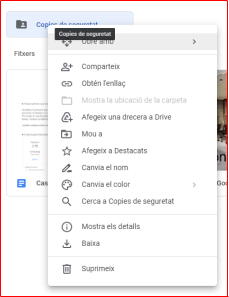
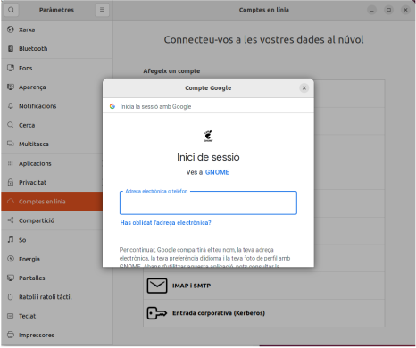
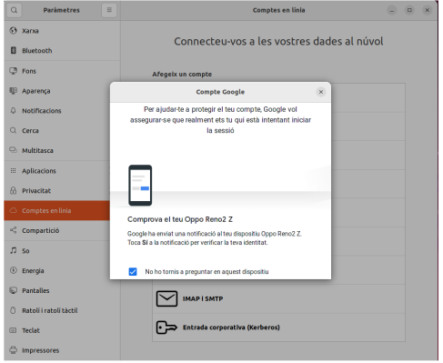
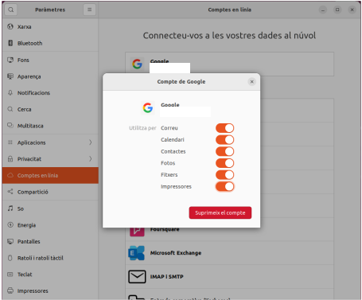
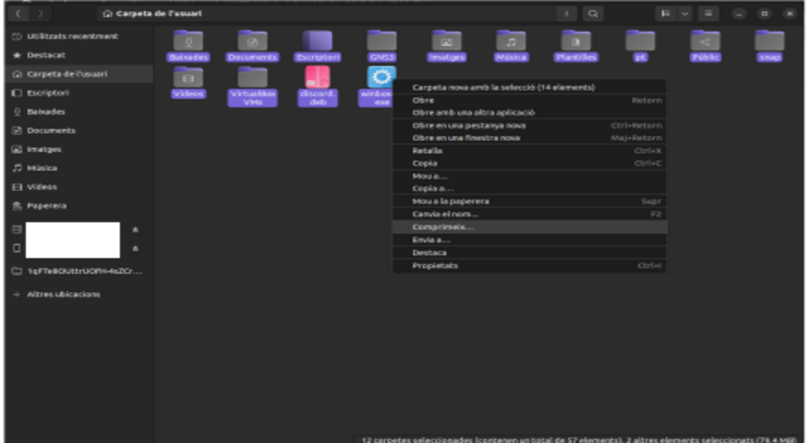

# CAS PRÀCTIC 1

## Index
- Per que hi es una bona opció?
- Pressupost mensual i anual.
- Guia de creació de la carpeta compartida i permisos assignats.
- Guia d'instalació d'adreces d'interes al escriptori.

##### CAS PRÀCTIC 1
- Exemples d'ús per fer un backup.
- Exemples d'us de consultar els permisos a un document per part de l'usuari.
- Comprovació de eliminacio sense voler d'un arxiu per part de l'usuari.

##### PER QUE ES UNA BONA OPCIÓ?

Nosaltres hi pensem que hi és una bona opció, ja que en cas de que el disc dur es negi ha
funcionar, hi tindrem un respald més.

Per a que en cas de perdre totes les dades poder recuperar-les. Ja que si no trobem les
dades i tindrem problemes per comunicar-se amb els clients.

I podem arribar a tenir problemes.

##### PESSUPOST

El pressupost original esta en la mateixa carpeta del Cas1.

##### GUIA DE CREACIÓ DE LA CARPETA COMPARTIDA I PERMISOS ASSIGNATS.

En aquest cas, per fer la creació de la unitat compartida, el primer que hi hem de fer es una
carpeta. L’administrador hi serà el propietari.

Per crear la carpeta. hem d’anar al drive i alli on volem fer-la, hem de fer botó dret hi anar a
la part del desplegable on posa crear carpeta.

Un cop hi apretem el botó, ens demana un nom per a la carpeta i així hi sortirà.

En aquest cas, per veure els permisos que hi tenim, hi hem d’anar a fer botó dret damunt la
carpeta hi anar a compartir.

Un cop dins de l’apartat, compartir, sols hi hem d'anar a veure les persones que hi hem
compartit hi poden veure la carpeta. Hi en aquest cas l’administrador seria el propietari, i
l’altre correu el tindriem sols que posar amb mode lectura.

##### GUIA D'INSTALACIÓ D'ADRECES D'INTERES A L'ESCRIPTORI.

Per a tenir accés directe a les carpetes, en aquest cas el primer que hi hem de fer es
vincular el compte amb l’equip.

Per fer això amb Ubuntu, hem d’obrir els paràmetres i anar a l’apartat de línia.

En aquest cas, ho vincularem amb el compte de google.

Després de posar el nostre correu, ens demana la contrasenya.
Un cop posada ens demana per confirmar que hi som nosaltres.

Un cop feta aquesta confirmació, ja ens apareixerà el compte com a vinculat.

Un cop ja veiem el nostre correu, ens tindria que tenir un apartat als arxius amb el nom del
nostre correu.

Un cop ja ens surt aquí, hi hem de crear un accés directe.

#### CAS PRÀCTIC 1

##### EXEMPLES D'ÚS PER FER UN BACKUP.

Primer que tot, fem el backup, el que he fet a sigut seleccionar les carpete del mes usuari i
les he comprimit.

Una vegada ja tinc la copia de seguretat, el que he fet a sigut moure l’arxiu dintre de la
carpeta compartida “Copia seguretat” al Google Drive Dins la carpeta que hi hem preparat
per les còpies.

##### EXEMPLES D'ÚS PER CONSULTAR UN DOCUMENT PER PART DE L'USUARI

Al nomes tindre permisos de lectura, no em deixa escriure en el document ni modificar cap
paràmetre.

##### COMPROVACIÓ DE ELIMINACIÓ D'ÚN DOCUMENT SENSE VOLER PER PART DE L'USUARI.

Com es pot veure a la captura, no em deixa esborrar cap document de la carpeta.

