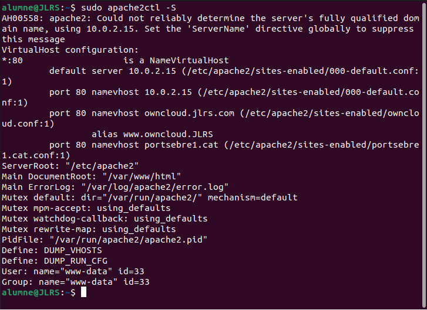

# Activitat 3:

Per fer aquesta activitat comptem amb que **ja s'ha configurat el servei Owncloud a una Màquina Virtual** (MV).

**3.1.-** Llista els Virtual Hosts d'Apache per tal de veure si **owncloud.XYZ.com** està habilitat amb la comanda:

```
apache2ctl -S
``` 



**3.2.-** A Owncloud podem veure que hi ha una serie de carpetes per defecte, mostra la ruta real a les tres carpetes dins de la teva MV.


**3.3.-** Al directori **Learn more about owncloud** hi ha informació en forma de fitxers pdf. Consulta'ls i respon aquestes preguntes:

-## Quin són els tres tipus de protecció de dades que ofereix Owncloud? 
Els tres tipus de protecció de dades que ofereix owncloud son: 1. Encryption in Transit, 2. Encryption at Rest i End-to-End Encryption.

## - Fes una petita descripció de cada un d'ells.
  - 1. Encryption in Transit.
Aquest xifratge esta disponible per disseny i per defecte. S'assegura mitjançant HTTPS i aprofitant el TLS més recent de protocols en tot els navegadors i clients compatibles.
Es el mateix per a les conexxions, emagatzematge, directoris i servidors d'autenticació.
  
  - 2.A Encryption at Rest.
El xifratge en repost, el que hi fa es xifrar tots els ditxers desats al servidor owncloud abans de desar.los a l'emagatzematge real.
Aquesta forma de xifrar, es suficien per evitar problemes de secret de dades relacionades amb l'emagatzematge i disc durs robats.

  - 2.B Encryption at Rest with Master Key in Hardware Security Module. (HSM)
Per a que Owncloud pugi excloure a l'administrador del sistema per tal de desxifrar fitxers, owncloud permet posar clau mestra en un HSM.
Aixó significa que la clau per tenir acces, s'hi guarda a l'HSM i es desxifra a traves d'un procés d'ins de l'aplicació Owncloud
Aixo es mentre el sistema hi estigui ences, el administrador no hi podra llegir els continguts.
Per raons practiques, els titols i nom del fitxers no es xifraran.

  - 3. End-to-End Encryption.
Aquesta encryptació utilitza el xifratge d'extrem a extrem. Aquest es el nivell mes alt de dades sectret combinat amb el mes alt nivell de protecció de dades.
Les desventatges son que l'usuari he de pensar els requisits de secret o de protecció de dades.
En cas de perdua de la clau xifrada a owncloud no hi ha cap forma de desxifrar els documents.

## - Per quina raó ens recomana utilitzar Owncloud per als documents de Microsoft Office de la nostra empresa?
Per la llei de comunitat europea, tots els arxius confidencials i han de estar fisicament a l'empresa.

## - Això passa a tots els països? 
No hi passa a tots els paisos.

## - Quina és la llicència d'OWncloud Enterprise?
La llicencia es la ownCloud Commencial License

## - I la d'Owncloud Standard?
Per al Standard hi es la llicencia AGPLv3.

## - Es poden veure videos en Streaming directament des de Owncloud?
Si que es poden veure videos amb streaming.

## - Es poden connectar directoris de Google Drive a Owncloud?
Si que es poden conectar els directoris de Google Drive

## - I Dropbox?
També es poden conectar directoris de Dropbox.

## - Compta Owncloud amb antivirus? En cas afirmatiu com es diu? 
Si que hi compta amb antivirus, es diu: ClamAV

**RESPOSTA**

**3.4.-** Mostra els següents canvis de paràmetres d'usuari:

- Posa't una imatge d'usuari.
- Afegeix el teu mail de l'Institut.
- Canvia l'idioma a català.
- Mostra la versió d'Owncloud instal·lada.

Imatge d'usuari, mail de l'Institut i canvi de l'idioma.


Versió d'owncloud.


.


